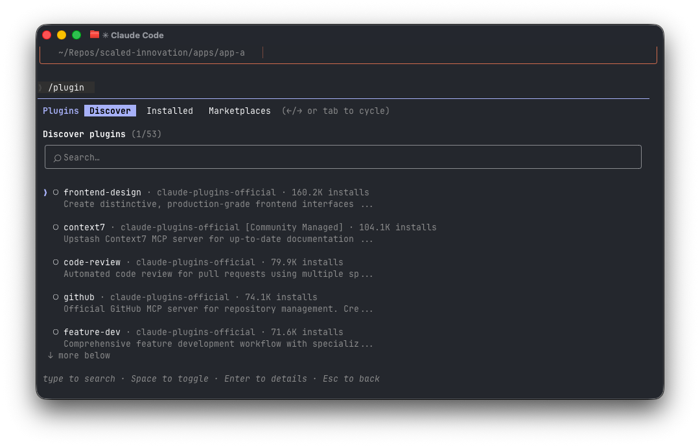
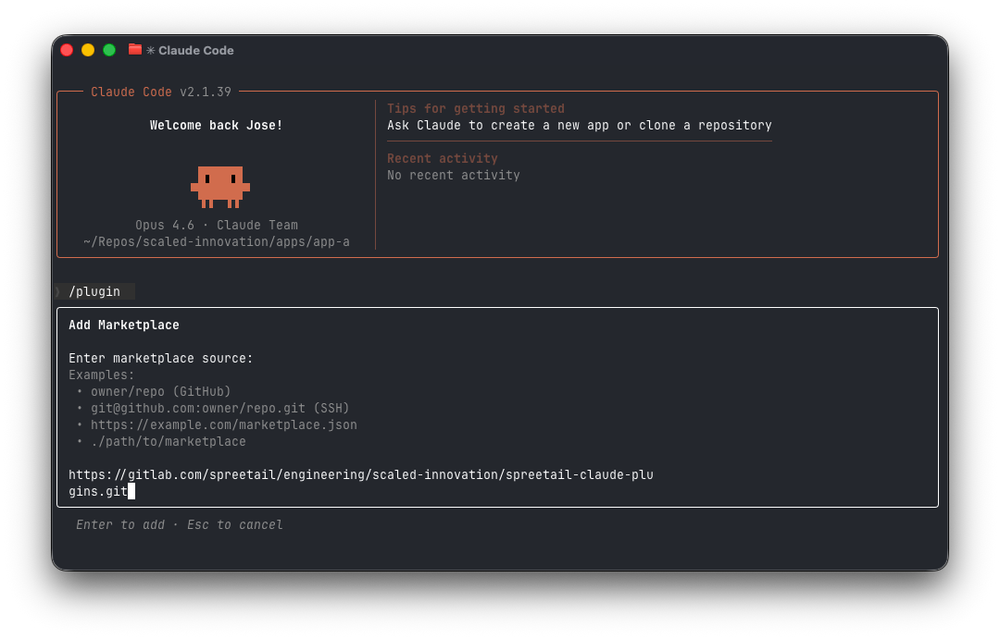
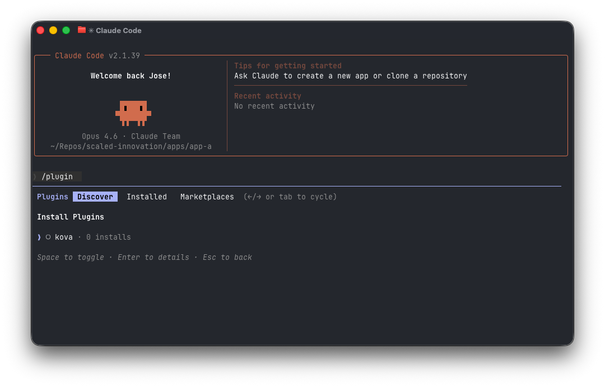
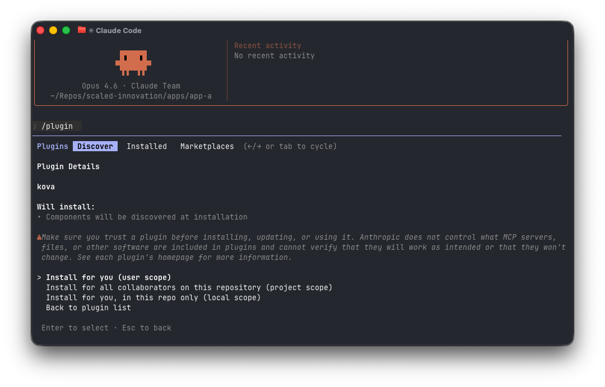
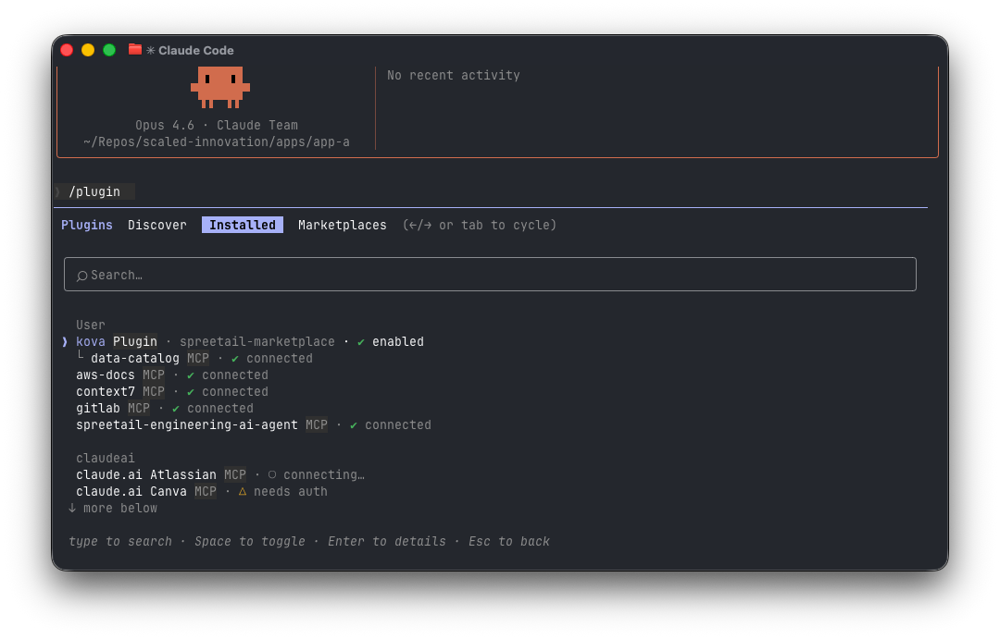

# Spreetail Claude Code Plugins

Spreetail's internal marketplace for [Claude Code](https://code.claude.com/docs/en/quickstart) plugins.

**Team:** Gemini

## Getting Started

### Prerequisites

- [Claude Code](https://code.claude.com/docs/en/quickstart) installed and authenticated
- Claude Code version 1.0.33 or later (`claude --version`)
- Authenticated to GitLab via HTTPS or SSH. You can use the [glab CLI](https://gitlab.com/gitlab-org/cli):
  ```bash
  glab auth login
  ```

### 1. Open the Plugin Manager

In Claude Code, type `/plugin` and press Enter to open the plugin manager.



### 2. Add the Marketplace

Use the arrow keys (or Tab) to navigate to the **Marketplaces** tab. Select **Add marketplace** and enter the repository URL:

```
https://gitlab.com/spreetail/engineering/scaled-innovation/spreetail-claude-plugins.git
```

After the marketplace finishes downloading, the plugin manager automatically switches to the **Discover** tab and shows the available plugins from the marketplace.



### 3. Install the Kova Plugin

From the discover view, select `kova` and press Enter to see the plugin details. Choose your install scope:

- **Install for you (user scope)** — available in all your projects
- **Install for all collaborators on this repository (project scope)** — shared with the team via repo settings
- **Install for you, in this repo only (local scope)** — available only in the current project




> **Tip:** If you skipped the install after adding the marketplace, you can always find the plugin later from the **Discover** tab by searching for `kova`.

### 4. Verify Installation

Open `/plugin` and navigate to the **Installed** tab — you should see `kova Plugin · spreetail-marketplace` listed.



### Updating

To update to the latest version of a plugin, open `/plugin`, go to the **Installed** tab, select the plugin, and choose **Update now**.

<details>
<summary>CLI commands (alternative)</summary>

```
/plugin marketplace add https://gitlab.com/spreetail/engineering/scaled-innovation/spreetail-claude-plugins.git
/plugin install kova@spreetail-marketplace
/plugin marketplace update spreetail-marketplace
```

</details>

## Plugins

| Plugin | Description | Docs |
|--------|-------------|------|
| **[kova](./kova-plugin)** | AI App Builder — TanStack Start apps with Spreetail's data platform | [README](./kova-plugin/README.md) · [Quick Start](./kova-plugin/QUICKSTART.md) |

## Making Changes

To update an existing plugin:

1. Make your changes in the plugin directory (e.g., `kova-plugin/`)
2. Bump the `version` in the plugin's `.claude-plugin/plugin.json`
3. Commit and merge to `main`

Users will see the update available in the plugin manager under **Installed > Update now**, or via `/plugin marketplace update spreetail-marketplace`.

The version bump is what signals to Claude Code that a new release is available — without it, users won't be prompted to update.

## Adding a Plugin

Each plugin lives in its own directory and is registered in [`.claude-plugin/marketplace.json`](./.claude-plugin/marketplace.json). To add a new plugin:

1. Create a directory with a `.claude-plugin/plugin.json` manifest
2. Add an entry to `marketplace.json`
3. Document it with a `README.md` and `QUICKSTART.md`

See the [Claude Code plugin docs](https://code.claude.com/docs/en/plugins) for the full authoring guide.

## Claude Code Plugin Resources

- [Create plugins](https://code.claude.com/docs/en/plugins) — Plugin authoring guide
- [Plugins reference](https://code.claude.com/docs/en/plugins-reference) — Full technical spec (manifest schema, directory structure, versioning)
- [Plugin marketplaces](https://code.claude.com/docs/en/plugin-marketplaces) — Creating and distributing marketplaces
- [Skills](https://code.claude.com/docs/en/skills) — Skill development details
- [Hooks](https://code.claude.com/docs/en/hooks) — Event handling and automation
- [MCP](https://code.claude.com/docs/en/mcp) — External tool integration
