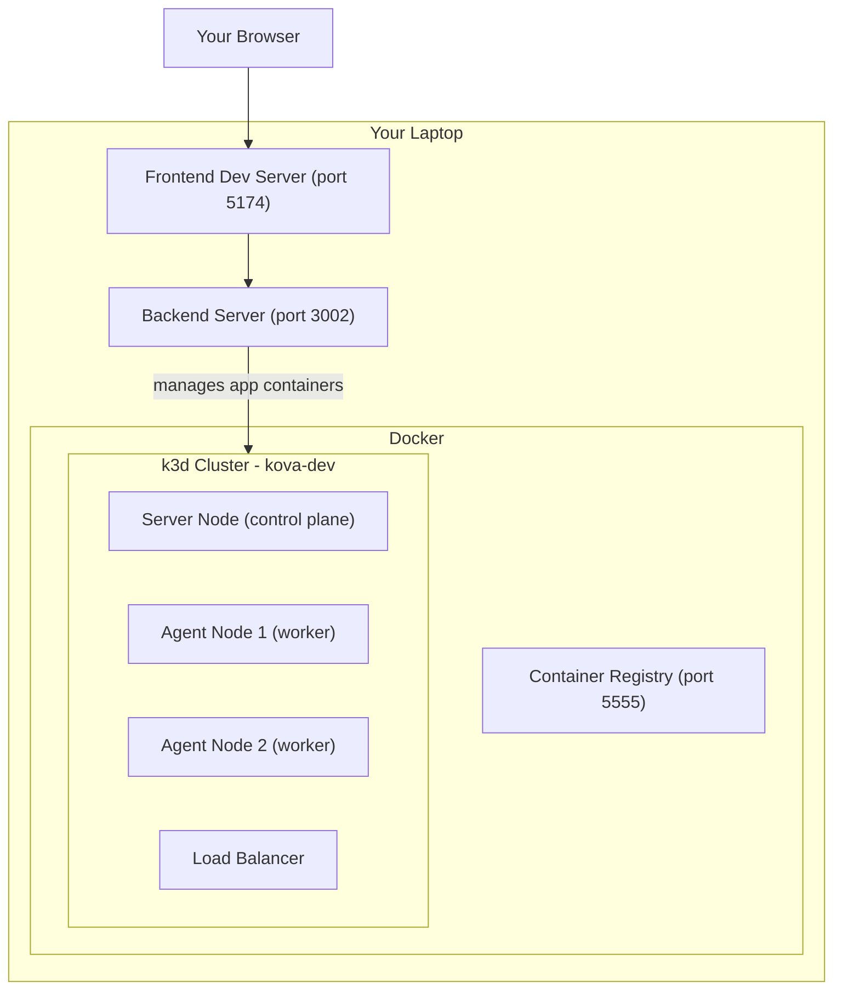
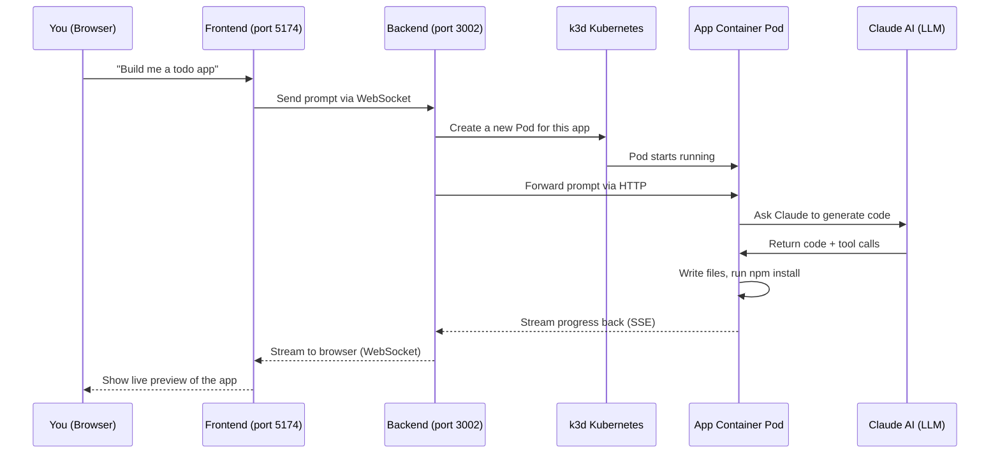

# Kova on k3d: A Beginner's Guide

A beginner-friendly explanation of what Kova is, what k3d is, why Kubernetes is used, and how all the pieces fit together when you run `cluster-up.ts`.

## What is Kova?

Kova is an AI-powered app builder (think of it like a tool where you describe what you want and an AI agent writes the code for you). It has three main parts:

- **Frontend** -- a React web app you open in your browser (port 5174)
- **Backend** -- a server that handles your requests, manages data, and talks to AI (port 3002)
- **App Containers** -- isolated sandbox environments where the AI agent actually writes and runs code for each app you create

## Why Kubernetes? Why not just run everything directly?

When you ask Kova to build an app, it needs to spin up a **separate, isolated container** for each app -- a little mini-computer where the AI can safely install npm packages, write files, and run a dev server. Kubernetes is the industry-standard tool for managing containers like this. It handles:

- Starting/stopping containers on demand
- Networking between containers
- Health monitoring (restarting crashed containers)
- Resource limits (so one app can't eat all your CPU/RAM)

## What is k3d?

Running a real Kubernetes cluster requires multiple servers. **k3d** is a tool that creates a lightweight Kubernetes cluster inside Docker containers on your laptop. Think of it as "Kubernetes in a box" -- you get a real Kubernetes environment without needing cloud servers.



## The Full Architecture

Here is how all the pieces connect when Kova is running:



## What `cluster-up.ts` Does (Step by Step)

The script at [scripts/cluster-up.ts](../scripts/cluster-up.ts) automates 6 major steps. Here is what each one does and why:

### Step 1: Create a Container Registry

```
k3d registry create kova-registry --port 5555
```

A **registry** is like a local warehouse for Docker images. When you build the `app-container` image, it gets stored here so the Kubernetes cluster can pull it when creating pods. Without this, k3d would try to download images from the internet (which would fail for your custom images).

### Step 2: Create the k3d Cluster

```
k3d cluster create kova-dev --servers 1 --agents 2 ...
```

This creates a 3-node Kubernetes cluster:

- **1 server node** -- the "brain" (control plane) that decides where to run things
- **2 agent nodes** -- the "workers" that actually run your app containers
- **Port mappings** -- so you can access services inside the cluster from your laptop:
  - `80/443` -- HTTP/HTTPS traffic (via load balancer)
  - `8080/8443` -- Istio ingress (for app previews)
  - `5433` -- PostgreSQL database

### Step 3: Create Namespaces

```
kubectl create namespace kova
kubectl create namespace kova-apps
kubectl create namespace istio-system
```

**Namespaces** are like folders in Kubernetes -- they organize and isolate resources:

- `kova` -- where the database and core infrastructure live
- `kova-apps` -- where user app containers get created
- `istio-system` -- where the networking/traffic management layer lives

### Step 4: Install Istio

Istio is a **service mesh** -- it manages network traffic between services. In Kova's case, it provides:

- **HTTPS with real TLS certificates** -- so app previews use `https://` with a valid cert
- **Traffic routing** -- routes requests like `app-123.dev.toolkit.co` to the correct app container
- **An ingress gateway** -- a single entry point that directs incoming traffic

### Step 5: Copy the TLS Certificate

```
copyDevCertToLocal()  // copies from dev01-eks-app-ro EKS cluster
```

This copies a real Let's Encrypt wildcard TLS certificate (`*.dev.toolkit.co`) from the team's shared AWS EKS cluster to your local k3d. This is why you need the `dev01-eks-app-ro` kubectl context -- it reads the cert from the remote cluster and installs it locally so your browser trusts the HTTPS connections.

### Step 6: Deploy PostgreSQL

```
kubectl apply -f manifests/kova/postgres.yaml
```

Deploys a PostgreSQL database inside the cluster. This stores:

- User accounts
- App metadata (names, settings)
- Chat history (your conversations with the AI)
- File snapshots

It is exposed on `localhost:5433` so the backend (running outside the cluster) can connect to it.

## After `cluster-up.ts`: The Remaining Steps

The cluster-up script only sets up the infrastructure. You still need:

| Step | Command | What it does |
|------|---------|-------------|
| Run DB migrations | `bun run db:migrate` | Creates the database tables (users, apps, chats, etc.) |
| Build app container | `bun run container:rebuild` | Builds the Docker image that the AI agent runs inside |
| Seed dev user | `bun run --cwd backend seed:dev-user` | Creates a test account (`dev@kova.local` / `devpassword123`) |
| Start the app | `bun run dev:full` | Launches the frontend (port 5174) and backend (port 3002) |

## Key Concepts Glossary

- **Pod** -- the smallest unit in Kubernetes; a wrapper around one or more containers. Each Kova app gets its own pod.
- **Namespace** -- a logical grouping/folder inside Kubernetes to keep things organized.
- **kubectl** -- the command-line tool to interact with Kubernetes ("kube control").
- **kubeconfig** -- a config file (`~/.kube/config`) that tells kubectl which clusters exist and how to authenticate.
- **Context** -- a saved connection profile in kubeconfig (cluster + credentials + namespace). `k3d-kova-dev` is your local context; `dev01-eks-app-ro` is the remote AWS one.
- **Service mesh (Istio)** -- a layer that manages how services talk to each other, with features like TLS, routing, and load balancing.
- **Ingress** -- the front door for traffic coming into the cluster from outside.
- **Container registry** -- a storage service for Docker images (like a local Docker Hub).
